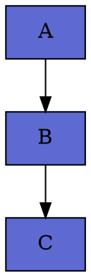
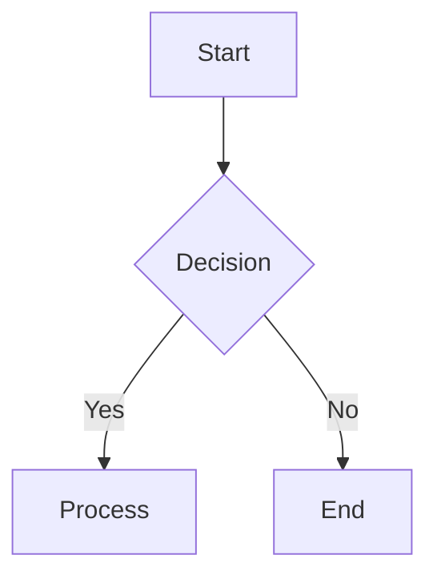

# 🎨 Kre8 Diagram Builder

A sleek, dark-themed diagram builder with WebSocket terminal integration for Claude Code. Build and customize any type of diagram with AI assistance.


## ✨ Features

- **🎨 Linear-Inspired Dark Theme** - Beautiful, modern UI inspired by Linear app
- **🤖 Claude Code Integration** - AI-powered diagram generation via WebSocket terminal
- **📊 Multiple Diagram Types**:
  - Architecture Diagrams
  - Flowcharts
  - Sequence Diagrams
  - ERD (Entity Relationship Diagrams)
  - Network Diagrams
  - UML Class Diagrams

- **🔧 Multiple Formats Supported**:
  - Graphviz (DOT)
  - Mermaid
  - D2
  - PlantUML
  - Draw.io XML

- **💾 Export Options**:
  - PNG
  - SVG
  - PDF
  - Draw.io (editable format)

- **⚡ Real-time Preview** - See changes instantly
- **🔍 Zoom Controls** - Zoom in/out and reset
- **🎯 AI Templates** - Quick start with pre-built templates

## 🚀 Quick Start

### Prerequisites

1. **Python 3.8+**
2. **Node.js** (for optional Mermaid support)
3. **Graphviz** system package
4. **Anthropic API Key** (for Claude Code integration)

### Installation

1. **Clone/Navigate to the project**:
   ```bash
   cd /Users/kcdacre8tor/kre8_diagram_builder
   ```

2. **Install Python dependencies**:
   ```bash
   pip install -r requirements.txt
   ```

3. **Install Graphviz** (system package):
   ```bash
   # macOS
   brew install graphviz

   # Ubuntu/Debian
   sudo apt-get install graphviz

   # Windows
   # Download from: https://graphviz.org/download/
   ```

4. **Optional: Install Mermaid CLI** (for Mermaid support):
   ```bash
   npm install -g @mermaid-js/mermaid-cli
   ```

5. **Optional: Install D2** (for D2 support):
   ```bash
   # macOS
   brew install d2

   # Or download from: https://d2lang.com/
   ```

6. **Set up environment variables**:
   ```bash
   export ANTHROPIC_API_KEY="your-api-key-here"
   ```

### Running the Application

You need to start **two servers**:

#### 1. Start the Diagram Renderer (Backend)
```bash
python renderer.py
```
This starts on `http://localhost:8000`

#### 2. Start the Claude Code WebSocket Server
```bash
python server.py
```
This starts on `ws://localhost:8765`

#### 3. Open the Web Interface
```bash
# Simple HTTP server for the frontend
python -m http.server 3000
```
Then open `http://localhost:3000` in your browser

Or use any web server:
```bash
# Using Node's http-server
npx http-server -p 3000

# Or PHP
php -S localhost:3000
```

## 📖 Usage

### Basic Workflow

1. **Select Diagram Type** - Choose from the sidebar (Architecture, Flowchart, etc.)
2. **Edit Code** - Modify the diagram code in the editor
3. **See Preview** - Real-time preview updates automatically
4. **Use Claude Terminal** - Click terminal icon and ask Claude to generate/modify diagrams
5. **Export** - Download in your preferred format

### Using the Claude Terminal

Click the terminal icon in the toolbar to open the Claude Code terminal:

```
→ Generate an AWS 3-tier architecture diagram
→ Add a load balancer to the current diagram
→ Create a microservices architecture with 5 services
→ Generate a database schema for an e-commerce app
```

### Example Prompts

- "Create a Kubernetes deployment diagram"
- "Generate a CI/CD pipeline flowchart"
- "Design a microservices architecture with API gateway"
- "Build a network topology for an office with 3 floors"
- "Create an ERD for a social media platform"

## 🎨 Diagram Templates

### Graphviz (DOT)


### Mermaid


### D2
```d2
x -> y: Connection
y -> z: Flow
```

## 🛠️ Configuration

### Theme Customization

Edit `styles.css` to customize colors:

```css
:root {
  --bg-primary: #0D0E11;
  --accent-primary: #5E6AD2;
  --accent-secondary: #26B5CE;
}
```

### Server Ports

- **Renderer**: `8000` (HTTP)
- **WebSocket**: `8765` (WS)
- **Frontend**: `3000` (HTTP)

## 🔧 Troubleshooting

### WebSocket Not Connecting
- Ensure `server.py` is running
- Check ANTHROPIC_API_KEY is set
- Verify port 8765 is not in use

### Preview Not Rendering
- Ensure `renderer.py` is running
- Check Graphviz is installed: `dot -V`
- Verify port 8000 is accessible

### Mermaid Diagrams Not Working
```bash
npm install -g @mermaid-js/mermaid-cli
```

### D2 Diagrams Not Working
```bash
brew install d2  # macOS
# or download from https://d2lang.com/
```

## 📁 Project Structure

```
kre8_diagram_builder/
├── index.html          # Main web interface
├── styles.css          # Linear-inspired dark theme
├── app.js              # Frontend JavaScript
├── server.py           # WebSocket server for Claude Code
├── renderer.py         # Diagram rendering server
├── requirements.txt    # Python dependencies
├── kre8_diagrams.txt   # Reference transcript
└── README.md           # This file
```

## 🌟 Features in Detail

### Real-time Collaboration
- Live diagram updates
- WebSocket-based communication
- Multi-client support

### AI-Powered Generation
- Natural language diagram creation
- Context-aware modifications
- Template-based quick start

### Export Flexibility
- Multiple output formats
- High-resolution exports
- Editable Draw.io format

## 🤝 Contributing

This is a personal project for diagram creation. Feel free to fork and customize!

## 📄 License

MIT License - Feel free to use and modify

## 🙏 Acknowledgments

- Inspired by [Linear](https://linear.app) design
- Built with [Claude Code](https://claude.com)
- Uses Graphviz, Mermaid, D2, and PlantUML

## 📞 Support

For issues or questions:
1. Check the troubleshooting section
2. Review the transcript: `kre8_diagrams.txt`
3. Ensure all dependencies are installed

---

**Built with ❤️ using Claude Code and inspired by the video tutorial on architecture diagram generation**
